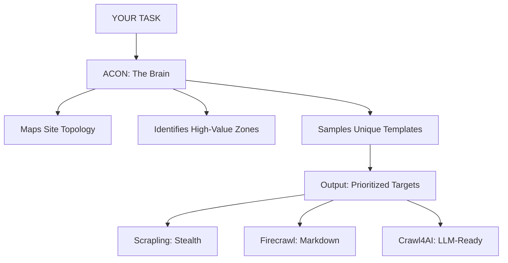

<div align="center">
  
  <h1>Acon — The Intelligent Brain for Any Scraper</h1>
  <p>Acon doesn't replace Scrapling or Firecrawl. It tells them where to look.</p>
</div>

---

## 🏗️ The Core Thesis
Most modern web scrapers suffer from **"URL Exhaustion"**—they spend 90% of their bandwidth fetching identical product or blog pages. Acon introduces a **Topology Orchestrator** that maps, classifies, and samples site structures to find the "Skeleton" of a site before you spend a cent on proxies.

### 💰 Why Acon? (Efficiency at Scale)
> **Benchmark in progress.** Early results show **57-77% crawl reduction** on e-commerce and content sites. Acon requires sufficient budget to reach template saturation — efficiency improves exponentially at scale.

---

## 🗺️ Architecture: The Brain vs. The Muscle
Acon acts as the **Intelligence Layer** that guides your existing scraping stack.



---

## 🗼 Visualizing Discovery
Acon includes an **Interactive Visualizer** that generates a zoomable site tree.
- **Interactivity**: Zoom, pan, and drag to explore deep hierarchies.
- **Intelligence**: Color-coded nodes (Home, Nav, Interaction, Standard).
- **Transparency**: Hover over any node to see the full discovery URL and metadata.

## 🔬 Credibility Benchmark (Honest Results)
> Benchmarks run with a 30-page discovery budget. Acon requires sufficient budget to reach template saturation — results improve significantly at scale.

| Site | Type | Efficiency | Note |
| :--- | :--- | :--- | :--- |
| `quotes.toscrape.com` | Content | **76.7%** | ✅ Ideal use case |
| `books.toscrape.com` | E-commerce | **56.7%** | ✅ Grows with scale |
| `scrapethissite.com` | Directory | **19.0%** | ✅ Moderate templates |
| `news.ycombinator.com` | News | **0.0%** | Expected — flat structure |
| `wikipedia.org` | Wiki | **0.0%** | Expected — unique deep links |

### 💡 When to use Acon
- **✅ Use for**: E-commerce stores, Blogs, Documentation sites, and Hierarchical directories.
- **❌ Not for**: Real-time news feeds, Infinite-scrolling social feeds, or single-page apps with no internal links.

---

## 🚀 Getting Started

### Installation
```bash
git clone https://github.com/WillyEverGreen/acon
cd acon
pip install -e .
```

### Running the Demo
```bash
python example.py
```
This will crawl `quotes.toscrape.com`, generate a dense topology map, and save it to `topology_viz.html`.

---

## 🚀 Contributing Roadmap
- [ ] **Stealth Integration**: Native support for **Camoufox** as an optional driver for world-class anti-bot bypass.
- [ ] **LLM-Ready Extraction**: Native **Trafilatura** pipeline for high-fidelity boilerplate removal and Markdown output.
- [ ] **Enterprise Persistence**: SQLite/Redis-backed queues for multi-day, resumable crawls.
- [ ] **Self-Healing Selectors**: Intelligent structural parsing that adapts to site redesigns.

---
*Acon is a standalone module designed for high-efficiency site intelligence.*
